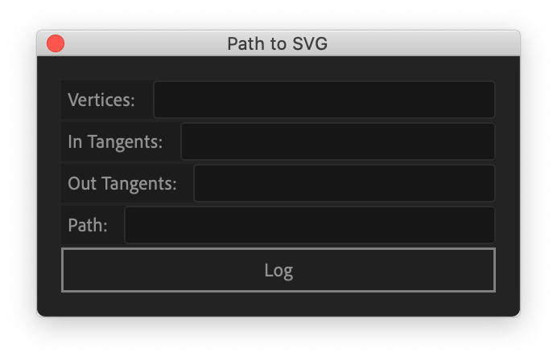
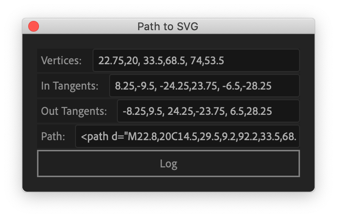
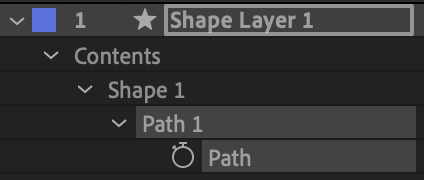

# ae-pathToSVG
Converts an After Effects path layer to an SVG path

### Installation
* Copy *script/pathToSVG.jsxbin* and paste into *Applications/Adobe After Effects/ScriptUI Panels*

### Here's the script when you first open it.

### Here's the script after you've logged path data.

### Here's what a selected path layer looks like for the script to work.

